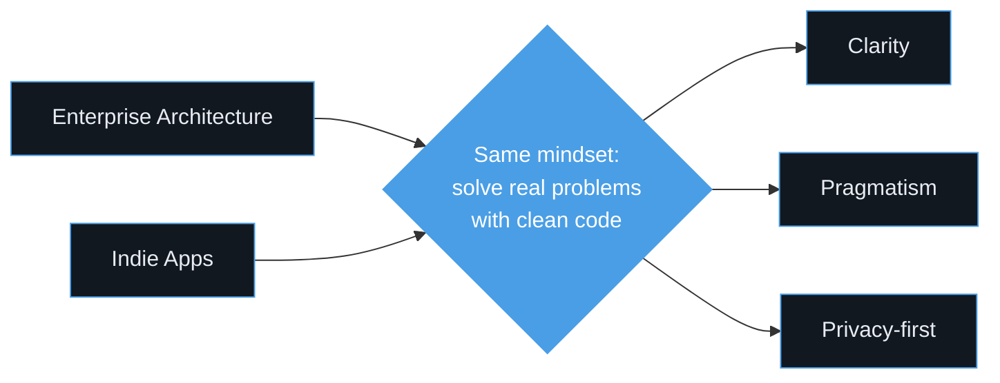

# Christopher Ramm

### Enterprise architect. Indie builder.

DCX CTO Germany @ Capgemini &nbsp;·&nbsp; Salesforce CTA &nbsp;·&nbsp; Salesforce MVP '25

[**cramm.dev**](https://cramm.dev) &nbsp;·&nbsp; [LinkedIn](https://www.linkedin.com/in/cramm/) &nbsp;·&nbsp; [Speaking](https://cramm.dev/speaking.html)

---

By day, I lead digital customer experience strategy as DCX CTO Germany at Capgemini — advising C-level stakeholders on Salesforce architecture, AI adoption, and platform transformation across Automotive, Manufacturing, Financial Services, and Public Sector.

By night, I build native apps that solve real problems with clean code, thoughtful UX, and zero compromises on privacy.

> [!NOTE]
> **Currently shipping:** MilesLeft (App Store submission in progress) · bauchgut (pre-release audit) · ThermaSync (watchOS app + iOS companion)

## Apps

| App | What it does | Stack | Status |
|---|---|---|---|
| [**Miasanrot**](https://miasanrot.de) | FC Bayern community — news, podcast, forum, match coverage | iOS · Android · SwiftUI · Jetpack Compose | 🟢 Live |
| [**MilesLeft**](https://milesleft.app) | Running shoe wear tracker with biomechanical load algorithm | iOS · SwiftUI · SwiftData · HealthKit | 🟡 Coming Soon |
| [**bauchgut**](https://bauchgut.app) | Food intolerance companion — 900+ foods, barcode scanner, OCR | iOS · SwiftUI · SwiftData | 🟡 Coming Soon |
| [**ThermaSync**](https://cramm.dev#apps) | CORE 2 thermal sensor companion for heat training | watchOS · iOS · BLE · HealthKit | 🟡 Coming Soon |
| [**kudamm'31**](https://kudamm31.berlin) | Location-based audiowalk about the antisemitic pogrom on Berlin's Kurfürstendamm | iOS · SwiftUI · SwiftData · GPS Geofencing | 🟢 Live |

All apps share the same DNA: **native, privacy-first, offline-first, zero third-party trackers.**

## Featured Repositories

<table>
  <tr>
    <td width="50%" valign="top">
      <h3>📊 <a href="https://github.com/rammc/data360-credit-calculator">data360-credit-calculator</a></h3>
      

        
        
        
      

      
Open-source Salesforce <b>Data 360 credit consumption estimator</b> with AI-powered configuration. Single-file static app, deployable to any host.

    </td>
    <td width="50%" valign="top">
      <h3>⚛️ <a href="https://github.com/rammc/sf-react-pipeline-kanban">sf-react-pipeline-kanban</a></h3>
      

        
        
        
        
      

      
<b>Sales Pipeline Kanban</b> built with React on Salesforce Multi-Framework (Beta). Teaching repo for LWC devs new to React — drag-and-drop, weighted forecast, inline edit.

    </td>
  </tr>
  <tr>
    <td width="50%" valign="top">
      <h3>🎯 <a href="https://github.com/rammc/agentforce-grounding-demo">agentforce-grounding-demo</a></h3>
      

        
        
        
        
      

      
End-to-end comparison of two Agentforce grounding strategies — <b>Data Library vs. Hybrid Vector Search</b>. Eval harness, live-demo runbook, real architectural learnings.

    </td>
    <td width="50%" valign="top">
      <h3>🤖 <a href="https://github.com/rammc/salesforce-agent-script">salesforce-agent-script</a></h3>
      

        
        
        
      

      
A <b>Claude Skill</b> with accurate, source-grounded knowledge of Salesforce Agentforce Agent Script — syntax, patterns, antipatterns.

    </td>
  </tr>
  <tr>
    <td width="50%" valign="top">
      <h3>🚀 <a href="https://github.com/rammc/TDX-2026-Salesforce-DevOps-Multi-Org">TDX-2026-Salesforce-DevOps-Multi-Org</a></h3>
      

        
        
        
      

      
Companion repo for my <b>TDX 2026 session</b> on DevOps strategy for multi-org Salesforce — Package-Based and Repo-Driven delivery matrices.

    </td>
    <td width="50%" valign="top">
      <h3>💓 <a href="https://github.com/rammc/orgpulse-dev">orgpulse-dev</a></h3>
      

        
        
      

      
<b>OrgPulse</b> — Salesforce org performance analysis tool. Signal mapping, recommendations engine, and architectural assessments.

    </td>
  </tr>
</table>

## Speaking & Thought Leadership

15+ sessions at Dreamforce, World Tour, DevOps Dreamin and community events since 2022.

**Recent highlights:**
- **Overcoming Agentforce Antipatterns with the Right Data Management** — Odaseva Forum 2025
- **5 Case Studies: Real-World Wins with Well-Architected** — Dreamforce 2024
- **Architect's Approach to Governance** — Dreamforce 2023

→ Full list at [cramm.dev/speaking](https://cramm.dev/speaking.html)

## Architect Community

Leading the Salesforce Technical Architect community at Capgemini Germany — coaching architects on their path to CTA certification, facilitating mock review boards, and growing the next generation of technical leaders.

## Tech I work with

<b>Enterprise</b>

Salesforce Platform · Apex · LWC · OmniStudio · Data Cloud · Agentforce · Marketing Cloud · Service Cloud · Sales Cloud · Salesforce DevOps (Copado, Gearset, sf CLI) · Multi-Org Architecture · CI/CD · Well-Architected Framework

<b>Native</b>

Swift · SwiftUI · SwiftData · Kotlin · Jetpack Compose · watchOS · CoreBluetooth · HealthKit · WidgetKit · App Intents

<b>Web & Tooling</b>

HTML · CSS · JavaScript · TypeScript · React · GitHub Pages · GitHub Actions · Claude Code · Mermaid

## Two worlds, one mindset

---

📍 Berlin &nbsp;·&nbsp; 🏃 Runner &nbsp;·&nbsp; 🚴 Cyclist &nbsp;·&nbsp; ⚽ FC Bayern since forever

